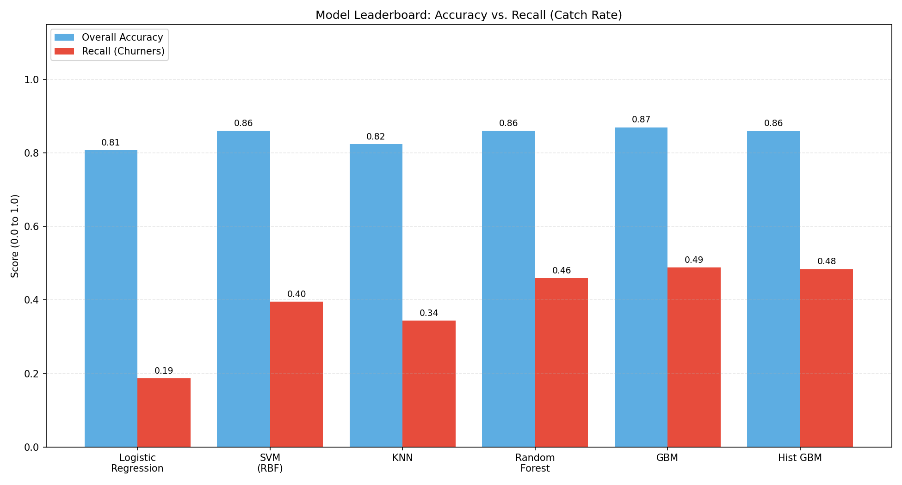
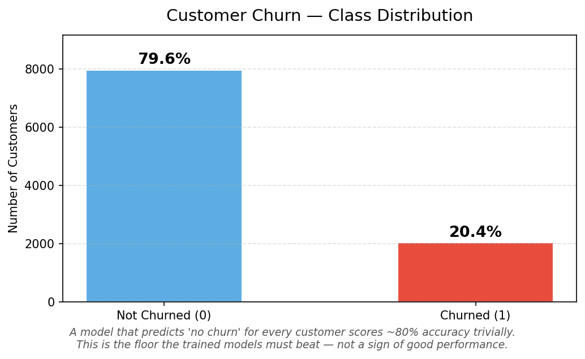
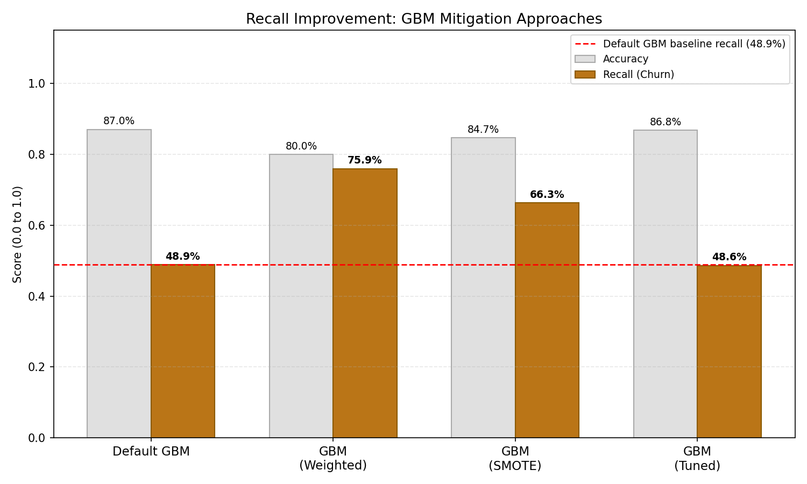
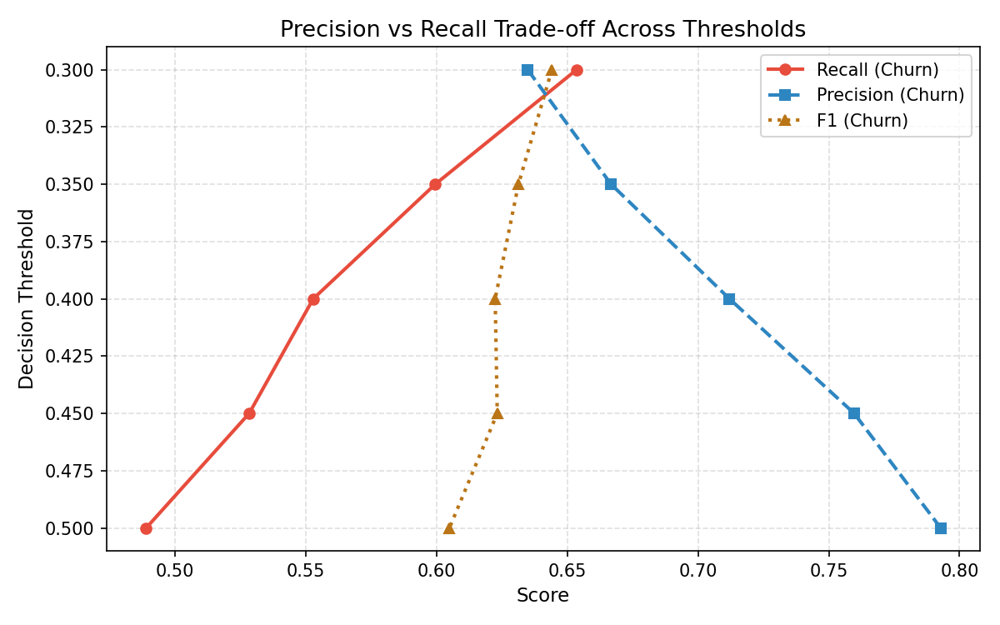
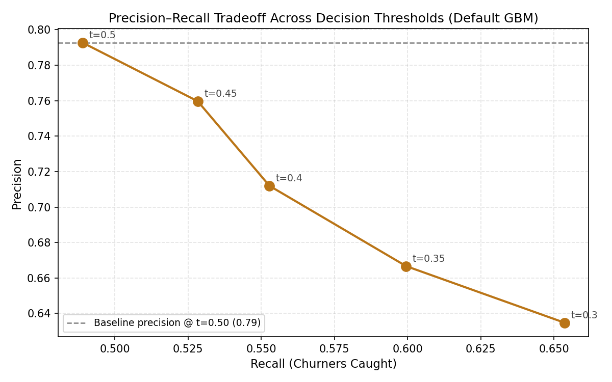
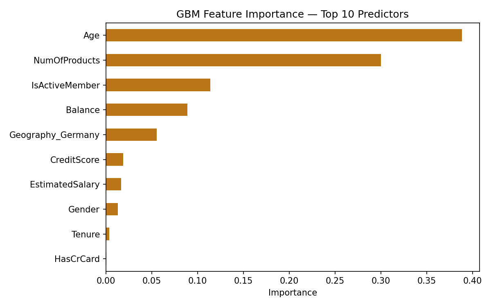
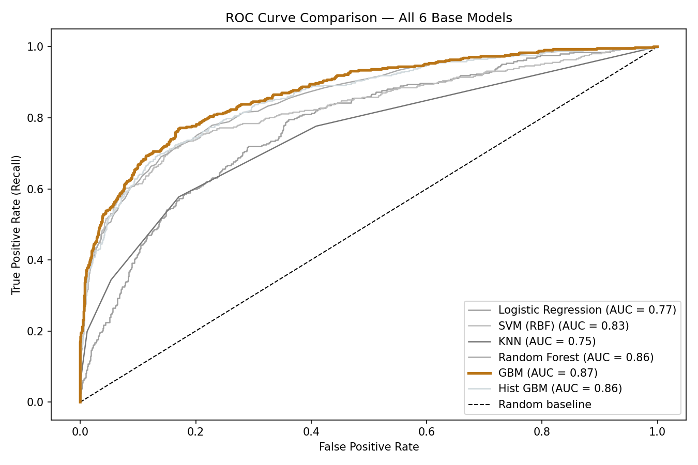

# Predicting Customer Churn: Selecting the Optimal ML Model

**Can a Machine Predict Which Bank Customers Will Leave — Before They Do?**

**Yes. And this project shows exactly how, what it gets right, and where it falls short.**

---

## The Business Problem

Every year, banks lose billions to customer churn. Acquiring a new customer costs 5–7× more than retaining an existing one — yet most banks have no systematic early-warning system. They find out a customer has left only after the account closes.

This project builds a machine learning model that analyses customer data and flags who is likely to leave *before* they do — giving a retention team a list of names to act on.

The dataset: **10,000 real bank customers**, each labelled as stayed or churned.

---

## Why Standard Accuracy Is the Wrong Measure Here

Here's the uncomfortable truth about this dataset: **8 out of every 10 customers didn't churn.** That means a model can score 80% accuracy by doing absolutely nothing — just predicting "stays" for everyone, every time.

That model would miss every single at-risk customer.

The right question isn't *"how often is the model correct overall?"* It's **"of all the customers who actually left, how many did the model catch?"** That metric is called **recall**, and it's what this project optimises for.

---

## Six Models, One Problem

Six machine learning algorithms were tested — from simple (Logistic Regression) to complex (Gradient Boosting). The chart below shows how each performed on both accuracy and recall:



**Reading the chart:** The blue bars show overall accuracy (all models look decent). The red bars show churner recall — how many at-risk customers were actually caught. This is where the real differences emerge.

Gradient Boosting (GBM) won on accuracy. But at 48.9% recall on churners, it was still **missing more than half the people about to leave** — barely better than a coin flip for the use case it was built for.

---

## Understanding the Root Cause: Class Imbalance

Before diving into solutions, it's important to understand *why* the models struggled with recall. The dataset has a structural problem:



Only 20.4% of customers churned. Models trained on this data naturally learn to predict "stays" — because that's almost always right. To catch churners, we need to correct for this imbalance explicitly.

---

## Three Interventions to Improve Churn Detection

Rather than accepting 49% recall as a ceiling, the project tested three practical approaches to improve it:

### 1. Synthetic Oversampling (SMOTE)
Artificially creates additional examples of the minority class (churners) during training, so the model learns what a churner looks like more thoroughly.
**Result: Recall improved from 48.9% → 66.3%**

### 2. Sample Weighting
Tells the model: *"mistakes on churners cost more than mistakes on stayers."* No new data — just a reweighted penalty during training.
**Result: Recall improved from 48.9% → 75.9%** ← best result overall

### 3. Threshold Adjustment
Every model produces a probability score (0–100%) for churn risk. Normally it flags anyone above 50% as at-risk. Lowering that threshold to 35% catches more churners without retraining the model at all.
**Result: Recall improved from 48.9% → 60.0%**

The chart below compares all four GBM configurations side by side:



---

## The Precision–Recall Tradeoff: A Business Decision, Not a Technical One

Improving recall comes with a cost: more false alarms. If the model flags 100 customers as at-risk and only 60 of them were actually going to leave, the retention team wastes effort on 40 people who didn't need intervention.

The charts below make this tradeoff visible — so a business can choose the operating point that fits its retention team's capacity:




**Practical guidance:**
- **Small retention team, limited budget** → Use SMOTE (66% recall, 62% precision). Fewer false alarms, manageable workload.
- **Large team, prioritise catching everyone** → Use Sample Weighting (76% recall, 51% precision). Accept more false alarms in exchange for catching more real churners.

---

## What's Driving Churn? The Model's Reasoning

Understanding *which* customer attributes drive churn is as valuable as the prediction itself — it tells the business *where* to intervene.



**Key drivers identified:**
- **Age** — older customers churn at higher rates
- **Account Balance** — customers with large dormant balances are higher risk
- **Number of Products** — customers with only one product are significantly more likely to leave
- **Active Membership status** — inactive members churn at disproportionate rates

These aren't just model outputs — they're actionable signals. A retention campaign targeting inactive members with single products and growing balances is a directly derivable strategy from this analysis.

---

## Model Discrimination: AUC Comparison

The ROC curve below shows how well each model separates churners from non-churners across every possible threshold — not just the default. A perfect model would reach the top-left corner; a random guess follows the diagonal line.



GBM leads with an AUC of **0.871**, meaning it correctly ranks a churner above a non-churner 87% of the time — a meaningful edge over simpler models.

---

## Results Summary

| Configuration | Accuracy | Churner Recall | Notes |
|---|---|---|---|
| GBM (Sample Weighted) | 80.0% | **75.9%** | Best recall; higher false-alarm rate |
| GBM (SMOTE) | 84.7% | 66.3% | Best balance of recall and precision |
| Threshold @ 0.35 | 85.8% | 60.0% | No retraining required |
| GBM (default) | 87.0% | 48.9% | Baseline — misses half of churners |
| Hist GBM | 86.0% | 48.4% | |
| GBM (Tuned) | 86.6% | 48.2% | Tuning alone didn't solve imbalance |
| Random Forest | 86.1% | 46.0% | |
| SVM (RBF) | 86.1% | 39.6% | |
| KNN | 82.4% | 34.4% | |
| Logistic Regression | 80.8% | 18.7% | |

---

## Honest Limitations

Every real-world project has constraints. Here's what this one doesn't yet do:

- **Feature richness:** The dataset has 11 features. A production model would incorporate transaction recency, product usage frequency, service interaction history, and complaint logs — signals that are far more predictive than demographics alone.
- **Temporal dynamics:** Churn isn't a static label — it unfolds over time. A production model would use time-series features and rolling windows rather than a single snapshot.
- **Business cost calibration:** The model doesn't yet account for the *relative* cost of a false negative (missed churner) vs. a false positive (unnecessary retention offer). Incorporating these costs would allow threshold selection to be driven by P&L rather than statistics.
- **Benchmark dataset:** This is a standard Kaggle dataset, widely used in tutorials. The value here is in the *methodology* — the imbalance handling, threshold analysis, and mitigation framework — not the data itself.

---

## Tech Stack

Python · Scikit-learn · imbalanced-learn · Pandas · Matplotlib · Seaborn · Jupyter Notebook

---

## Data Source

[Kaggle — Bank Customer Churn Modelling](https://www.kaggle.com/datasets/shrutimechlearn/churn-modelling) · 10,000 rows · 14 features

---

## Project Structure

```
.
├── churn_prediction_model.ipynb   # Main analysis notebook
├── Churn_Modelling.csv            # Source dataset (10,000 rows)
├── gb_tuned_model.pkl             # Serialised tuned GBM (GridSearchCV best estimator)
├── images/
│   ├── customer_churn_class_distribution.png
│   ├── gbm_feature_importance_top_10_predictors.png
│   ├── model_leaderboard_accuracy_vs_recall_catch_rate.png
│   ├── precision_recall_tradeoff_decision_thresholds_default_gbm.png
│   ├── precision_vs_recall_tradeoff_across_thresholds.png
│   ├── recall_improvement_gbm_mitigation_approaches.png
│   └── roc_curve_comparison_all_6_base_models.png
├── .gitignore
└── README.md
```

---

## How to Run

1. Clone the repo
2. Install dependencies:
   ```bash
   pip install pandas numpy scikit-learn imbalanced-learn matplotlib seaborn
   ```
3. Open `churn_prediction_model.ipynb` and run all cells top to bottom

---


[Portfolio](https://aayushyagol.com) · [LinkedIn](https://linkedin.com/in/aayush-yagol-046874145) · [GitHub](https://github.com/ayusyagol11/multimodal_churn_prediction)